# Rashid Shamloo's Portfolio

This is my personal portfolio website. I have implemented various features into it to showcase my abilities as a front-end developer. It features an original design and many unique elements and effects.

## Table of contents

- [Links](#links)
- [Built with](#built-with)
- [Features](#features)
- [Screenshot](#screenshot)
- [Credits](#credits)
- [Author](#author)

## Links

- Live Website: https://www.rashidshamloo.com

## Built with

### Frameworks & Languages

- [TypeScript](https://www.typescriptlang.org)
- [React.js](https://react.dev)
- [Next.js](https://nextjs.org)
- [Redux Toolkit](https://redux-toolkit.js.org)
- [Tailwind CSS](https://tailwindcss.com)
- [Material UI](https://mui.com)

### My own packages used in this project

- [react-next-tilt](https://www.npmjs.com/package/react-next-tilt) - used in the profile card, the contact form, the showcase page, the blog page, and the packages page
- [react-flip-tilt](https://www.npmjs.com/package/react-flip-tilt) - used in the showcase page and the packages page
- [react-next-parallax](https://www.npmjs.com/package/react-next-parallax) - used in the showcase page, the packages page, and the error page
- [swiper-mods](https://www.npmjs.com/package/swiper-mods) - used in the slider in the showcase page

### Other packages used in this project

- [next-intl](https://next-intl-docs.vercel.app/) - internationalization (i18n)
- [budoux](https://github.com/google/budoux) - line/word break for the Japanese version
- [framer-motion](https://www.framer.com/motion) - reveal animations and header glow animation
- [@emailjs/browser](https://www.emailjs.com) - sending emails
- [react-hook-form](https://react-hook-form.com) - form validation
- [react-google-recaptcha](https://www.npmjs.com/package/react-google-recaptcha) - form reCAPTCHA
- [next-themes](https://www.npmjs.com/package/next-themes) - light/dark mode implementation
- [theme-toggles](https://toggles.dev/) - light/dark mode toggle
- [hamburger-react](https://www.npmjs.com/package/hamburger-react) - hamburger menu icon
- [react-awesome-button](https://www.npmjs.com/package/react-awesome-button) - buttons
- [highlight.js](https://highlightjs.org) - syntaxt highlighting for blog posts
- [react-syntax-highlighter](https://www.npmjs.com/package/react-syntax-highlighter) - syntax highlighting component used in the packages page
- [marked](https://marked.js.org) - markdown parsing
- [typed.js](https://www.npmjs.com/package/typed.js) - typewriter effect
- [react-device-detect](https://www.npmjs.com/package/react-device-detect) - device detection for disabling animation delay on mobile
- [react-loading](https://www.npmjs.com/package/react-loading) - loading animation
- [react-scroll-parallax](https://www.npmjs.com/package/react-scroll-parallax) - parallax scroll section in the showcase page
- [swiper](https://swiperjs.com) - used in the slider in the showcase page
- [react-icons](https://www.npmjs.com/package/react-icons) - icons
- [tailwindcss-3d](https://www.npmjs.com/package/tailwindcss-3d) - adding 3D transform classes to Tailwind
- [zod](https://zod.dev) - API response validation
- [validator](https://www.npmjs.com/package/validator) - string validation for blog slug
- [@vercel/analytics](https://vercel.com/analytics) - analytics

## Features

- General Features

  - Original light/dark design with many elements changing depending on the current mode
  - Responsive design and implementation for complex/interactive elements
  - English/Japanese internationalization (i18n) using [next-intl](https://next-intl-docs.vercel.app/)
  - Japanese line/word break using [BudouX](https://github.com/google/budoux)
  - Header glow animation and reveal animations using [Framer Motion](https://www.framer.com/motion)
  - "Scroll to top" button with light/dark mode and i18n support
  - SEO, Asset, and performance optimizations
  - All data is stored in JSON files and loaded dynamically for easy modification/scalibility

- Pages
  - Home
    - Profile card with 3D tilt effect using [react-next-tilt](https://www.npmjs.com/package/react-next-tilt)
    - Dynamic/Changing background/theme on scroll (inspired by: [linew.co.jp](https://linew.co.jp)) and moving background on hover
  - Showcase
    - Full-page navigation ported from [Clipboard Landing Page](https://github.com/rashidshamloo/fem_031_clipboard-landing-page) and converted from Material-UI to TailwindCSS and instead of using [react-intersection-observer](https://www.npmjs.com/package/react-intersection-observer) and refs, I used vanilla JavaScript [Intersection Observer](https://developer.mozilla.org/en-US/docs/Web/API/Intersection_Observer_API) and data attributes for a better/cleaner implementation.
    - Scroll snapping (proximity) to the top of the first section and center of other sections
    - Multiple Showcase sections to showcase my packages/skills including the [Japan-Slider](https://github.com/rashidshamloo/japan-slider) section.
  - Projects
    - Mock laptop/mobile preview made from scratch with support for switching between light/dark theme images and scrollable mobile image
    - Markdown parsing for the project desciption loaded from the JSON file
  - Packages
    - Usage instructions with syntax highlighting and light/dark mode support
    - Demo for packages that need one
  - Contact Me
    - Contact form with 3D tilt effect using [react-next-tilt](https://www.npmjs.com/package/react-next-tilt)
    - Form components using [Material UI](https://mui.com) with validation using [react-hook-form](https://react-hook-form.com)
    - Sending emails using [EmailJS](https://www.emailjs.com) with reCAPTCHA v2 validation
    - Interactive 3D postcard CSS effect with changing image based on light/dark mode (inspired by [this video](https://www.youtube.com/watch?v=9KwIE0t9Tkk) but made using Tailwind with adjustable number of segments)
    - Dynamic paper element that reflects the sender's name/email
  - Blog
    - Fetching posts from Dev.to API using Redux Thunk and storing them in Redux store
    - API response validation using [Zod](https://zod.dev)
    - Featured Articles section based on custom JSON data and Popular Articles section based on article reaction count
    - Fetching single blog posts on the server instead of client using server components
    - Custom pagination component
    - Styling blog posts using Tailwind for light/dark mode
    - Syntax highlighting using [highlight.js](https://highlightjs.org) with light/dark mode support

## Screenshot

### English

- Desktop

  - Dark

    [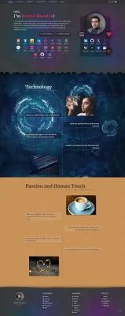](screenshots/en/screenshot-desktop-home-dark.png)
    [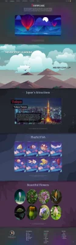](screenshots/en/screenshot-desktop-showcase-dark.png)
    [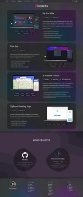](screenshots/en/screenshot-desktop-projects-dark.png)
    [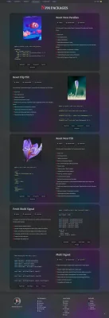](screenshots/en/screenshot-desktop-packages-dark.png)
    [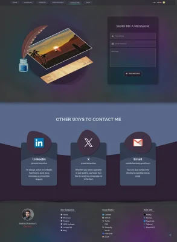](screenshots/en/screenshot-desktop-contact-dark.png)
    

  - Light

    [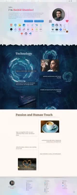](screenshots/en/screenshot-desktop-home-light.png)
    [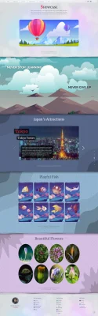](screenshots/en/screenshot-desktop-showcase-light.png)
    [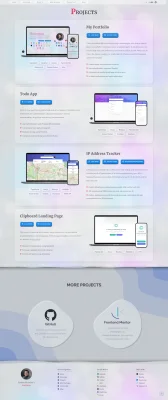](screenshots/en/screenshot-desktop-projects-light.png)
    [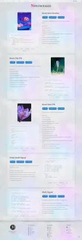](screenshots/en/screenshot-desktop-packages-light.png)
    [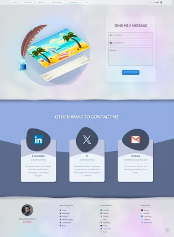](screenshots/en/screenshot-desktop-contact-light.png)
    [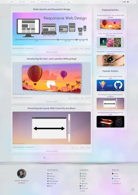](screenshots/en/screenshot-desktop-blog-light.png)

- Mobile

  - Dark

    
    
    [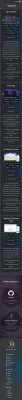](screenshots/en/screenshot-mobile-projects-dark.png)
    [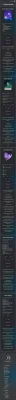](screenshots/en/screenshot-mobile-packages-dark.png)
    [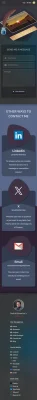](screenshots/en/screenshot-mobile-contact-dark.png)
    

  - Light

    [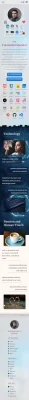](screenshots/en/screenshot-mobile-home-light.png)
    [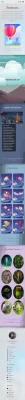](screenshots/en/screenshot-mobile-showcase-light.png)
    [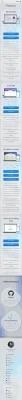](screenshots/en/screenshot-mobile-projects-light.png)
    
    [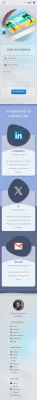](screenshots/en/screenshot-mobile-contact-light.png)
    [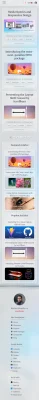](screenshots/en/screenshot-mobile-blog-light.png)

### Japanese

- Desktop

  - Dark

    [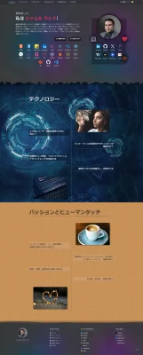](screenshots/ja/screenshot-desktop-home-dark.png)
    [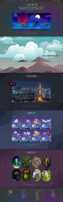](screenshots/ja/screenshot-desktop-showcase-dark.png)
    [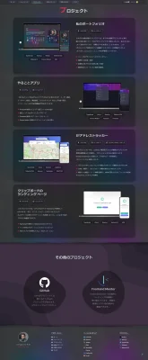](screenshots/ja/screenshot-desktop-projects-dark.png)
    [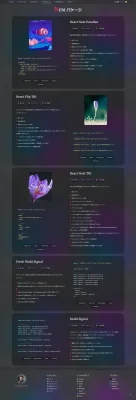](screenshots/ja/screenshot-desktop-packages-dark.png)
    [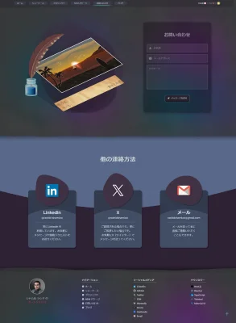](screenshots/ja/screenshot-desktop-contact-dark.png)
    [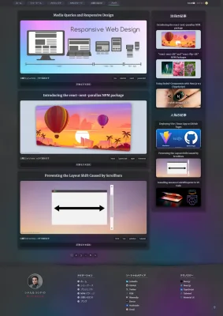](screenshots/ja/screenshot-desktop-blog-dark.png)

  - Light

    [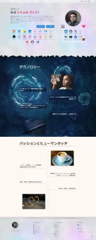](screenshots/ja/screenshot-desktop-home-light.png)
    [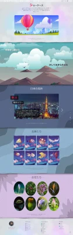](screenshots/ja/screenshot-desktop-showcase-light.png)
    [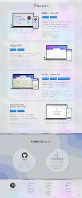](screenshots/ja/screenshot-desktop-projects-light.png)
    [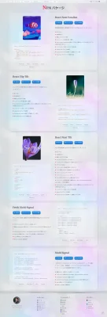](screenshots/ja/screenshot-desktop-packages-light.png)
    
    

- Mobile

  - Dark

    [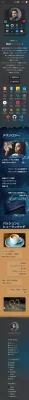](screenshots/ja/screenshot-mobile-home-dark.png)
    
    [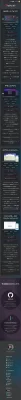](screenshots/ja/screenshot-mobile-projects-dark.png)
    
    [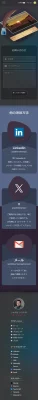](screenshots/ja/screenshot-mobile-contact-dark.png)
    [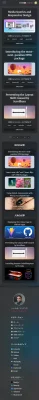](screenshots/ja/screenshot-mobile-blog-dark.png)

  - Light

    [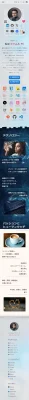](screenshots/ja/screenshot-mobile-home-light.png)
    [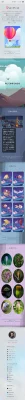](screenshots/ja/screenshot-mobile-showcase-light.png)
    [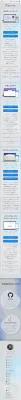](screenshots/ja/screenshot-mobile-projects-light.png)
    
    [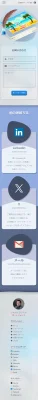](screenshots/ja/screenshot-mobile-contact-light.png)
    

## Credits

- General

  - SVG patterns/backgrounds are from either [Hero Patterns](https://heropatterns.com) or [Haikei](https://haikei.app) and modified by me
  - Background image is by [Alexander Grey](https://unsplash.com/@sharonmccutcheon) on [Unsplash](https://unsplash.com/photos/62vi3TG5EDg) but heavily modified by me

- Pages

  - Home
    - Icons are mostly from [Devicon](https://devicon.dev)
    - Technology background image by [xresch](https://pixabay.com/users/xresch-7410129/) on [Pixabay](https://pixabay.com/photos/circle-tech-technology-abstract-5090539/) and modified by me to be tilable
    - Other images by:
      - [Ali Pazani](https://www.pexels.com/@alipazani/) on [Pexels](https://www.pexels.com/photo/photo-of-woman-wearing-turtleneck-top-2777898/)
      - [Luca Bravo](https://unsplash.com/@lucabravo) on [Unsplash](https://unsplash.com/photos/XJXWbfSo2f0)
      - [Jeremy Yap](https://unsplash.com/@jeremyyappy) on [Unsplash](https://unsplash.com/photos/jn-HaGWe4yw)
      - [Fadi Xd](https://unsplash.com/@fadid000) on [Unsplash](https://unsplash.com/photos/I4dR572y7l0)
  - Showcase
    - Vector illustrations in the parallax scroll section by [craftpix.net](https://craftpix.net/freebies/free-horizontal-2d-game-backgrounds/?num=1&count=95&sq=parallax&pos=3)
    - Other vector illustrations by [Yuliya Pauliukevich](https://www.vecteezy.com/members/klyaksun) on [vecteezy.com](https://www.vecteezy.com/)
    - Flower Photos by:
      - <a href="https://unsplash.com/@mascapone31?utm_source=unsplash&utm_medium=referral&utm_content=creditCopyText">Markus Blüthner</a> on <a href="https://unsplash.com/photos/XGthimcNy-4?utm_source=unsplash&utm_medium=referral&utm_content=creditCopyText">Unsplash</a>
      - <a href="https://unsplash.com/@benyamin_bohlouli?utm_source=unsplash&utm_medium=referral&utm_content=creditCopyText">Benyamin Bohlouli</a> on <a href="https://unsplash.com/photos/HuzCqE21trM?utm_source=unsplash&utm_medium=referral&utm_content=creditCopyText">Unsplash</a>
      - <a href="https://unsplash.com/@cobrien112?utm_source=unsplash&utm_medium=referral&utm_content=creditCopyText">Caroline O'Brien</a> on <a href="https://unsplash.com/photos/_D9yLYoFrbk?utm_source=unsplash&utm_medium=referral&utm_content=creditCopyText">Unsplash</a>
      - <a href="https://unsplash.com/@laurarain?utm_source=unsplash&utm_medium=referral&utm_content=creditCopyText">Laura Crowe</a> on <a href="https://unsplash.com/photos/vsrEr7otP2o?utm_source=unsplash&utm_medium=referral&utm_content=creditCopyText">Unsplash</a>
      - <a href="https://unsplash.com/@bonniekdesign?utm_source=unsplash&utm_medium=referral&utm_content=creditCopyText">Bonnie Kittle</a> on <a href="https://unsplash.com/photos/dZk4ZWb_2bU?utm_source=unsplash&utm_medium=referral&utm_content=creditCopyText">Unsplash</a>
      - <a href="https://unsplash.com/@benjamindem?utm_source=unsplash&utm_medium=referral&utm_content=creditCopyText">Benjamin Demian</a> on <a href="https://unsplash.com/photos/kZ7Y9w8xFQk?utm_source=unsplash&utm_medium=referral&utm_content=creditCopyText">Unsplash</a>
      - [Plantpool images](https://www.pexels.com/@plantpool-images-2222972/) on [Pexels](https://www.pexels.com/photo/exotic-bird-of-paradise-flower-with-green-leaves-in-garden-4122419/)
      - [Magda Ehlers](https://www.pexels.com/@magda-ehlers-pexels/) on [Pexels](https://www.pexels.com/photo/a-close-up-shot-of-a-bird-of-paradise-flower-5766946/)
      - <a href="https://unsplash.com/@bardashka?utm_source=unsplash&utm_medium=referral&utm_content=creditCopyText">Oleksandra Bardash</a> on <a href="https://unsplash.com/photos/ho7xtBSwfnk?utm_source=unsplash&utm_medium=referral&utm_content=creditCopyText">Unsplash</a>
      - <a href="https://unsplash.com/@samhradh?utm_source=unsplash&utm_medium=referral&utm_content=creditCopyText">Summer Quinn</a> on <a href="https://unsplash.com/photos/a_AaJcNeksY?utm_source=unsplash&utm_medium=referral&utm_content=creditCopyText">Unsplash</a>
      - <a href="https://unsplash.com/@ashlynnephotos?utm_source=unsplash&utm_medium=referral&utm_content=creditCopyText">Ashley Levinson</a> on <a href="https://unsplash.com/photos/KgRPNtP7CQg?utm_source=unsplash&utm_medium=referral&utm_content=creditCopyText">Unsplash</a>
      - <a href="https://unsplash.com/@longlivehaas?utm_source=unsplash&utm_medium=referral&utm_content=creditCopyText">Jacinto Diego</a> on <a href="https://unsplash.com/photos/m9dJCR6Wu-U?utm_source=unsplash&utm_medium=referral&utm_content=creditCopyText">Unsplash</a>
      - <a href="https://unsplash.com/@elliot_c?utm_source=unsplash&utm_medium=referral&utm_content=creditCopyText">Elliot Cullen</a> on <a href="https://unsplash.com/photos/7XdcgLO0UBo?utm_source=unsplash&utm_medium=referral&utm_content=creditCopyText">Unsplash</a>
      - [Jeffry Surianto](https://www.pexels.com/@saturnus99/) on [Pexels](https://www.pexels.com/photo/photo-of-a-violet-bloom-of-agapanthus-africanus-flower-11570484/)
      - <a href="https://unsplash.com/@jcotten?utm_source=unsplash&utm_medium=referral&utm_content=creditCopyText">Joshua J. Cotten</a> on <a href="https://unsplash.com/photos/T4ApSOlhD3g?utm_source=unsplash&utm_medium=referral&utm_content=creditCopyText">Unsplash</a>
      - <a href="https://unsplash.com/@kazuend?utm_source=unsplash&utm_medium=referral&utm_content=creditCopyText">kazuend</a> on <a href="https://unsplash.com/photos/JHMDtWaNZaA?utm_source=unsplash&utm_medium=referral&utm_content=creditCopyText">Unsplash</a>
      - <a href="https://unsplash.com/@mmdam20?utm_source=unsplash&utm_medium=referral&utm_content=creditCopyText">Mohammad Mardani</a> on <a href="https://unsplash.com/photos/3-wFrzIoEE4?utm_source=unsplash&utm_medium=referral&utm_content=creditCopyText">Unsplash</a>
      - <a href="https://unsplash.com/@jim74tg?utm_source=unsplash&utm_medium=referral&utm_content=creditCopyText">James Morden</a> on <a href="https://unsplash.com/photos/tU8KQ_Y3nNY?utm_source=unsplash&utm_medium=referral&utm_content=creditCopyText">Unsplash</a>
      - <a href="https://unsplash.com/@s_erwin?utm_source=unsplash&utm_medium=referral&utm_content=creditCopyText">Sam Erwin</a> on <a href="https://unsplash.com/photos/VD-4BhSGTLI?utm_source=unsplash&utm_medium=referral&utm_content=creditCopyText">Unsplash</a>
      - <a href="https://unsplash.com/@yoksel?utm_source=unsplash&utm_medium=referral&utm_content=creditCopyText">Yoksel 🌿 Zok</a> on <a href="https://unsplash.com/photos/bh0ai10Cxc4?utm_source=unsplash&utm_medium=referral&utm_content=creditCopyText">Unsplash</a>
  - Projects
    - Device mock images by [Meta](https://design.facebook.com/toolsandresources/devices/)
  - Contact Me
    - Images by:
      - [craftpix.net](https://craftpix.net/freebies/free-beach-2d-game-backgrounds/)
      - [Pixabay](https://www.pexels.com/@pixabay/) on [Pixabay](https://www.pexels.com/photo/empty-brown-canvas-235985/)
      - [Timplaru Emil](https://www.vecteezy.com/members/emiltimplaru) on [Vecteezy](https://www.vecteezy.com/png/9383455-ink-bottle-clipart-design-illustration)

## Author

Rashid Shamloo

- Portfolio - [rashidshamloo.com](https://www.rashidshamloo.com)
- Linkedin - [rashid-shamloo](https://www.linkedin.com/in/rashid-shamloo/)
- Twitter - [@rashidshamloo](https://www.twitter.com/rashidshamloo)
- Dev.to - [@rashidshamloo](https://dev.to/rashidshamloo)
